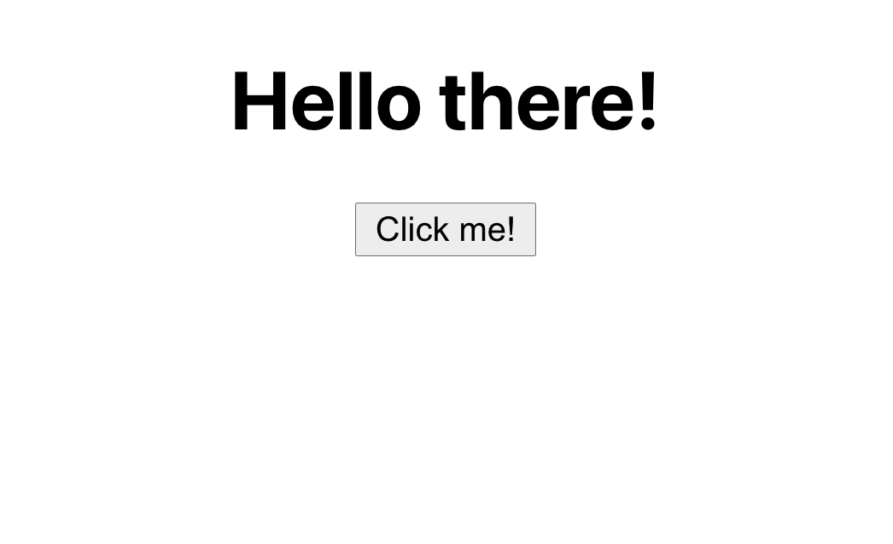

## STAR_WARS_CATALOGUE

[Miruna Nedelcu](mailto:miruna@codewithdragos.com)

## Assumptions

I will need a HOMEPAGE, CREATEPOST PAGE and a POSTPAGE.
Also a rest api and style components and cypress to test it.

## Proposed Solution

*TODO: [ADD_SOLUTION_DESCRIPTION]*
- Components folders with the pages
- Install style components and use it.
- Then get the api url.
- Install cypress and test my app.

## Screenshots

## Libraries / Tools Used

- React.js
- Style components
- Cypress 

## Setup

To install the dependencies run:

`npm install`

And to run the app:

`npm start`

### Running the tests

#### Unit Tests

You can run the unit tests using:

`npm test`

#### Integration Tests

To run Cypress in interactive mode run:

`npm run cy:start`

